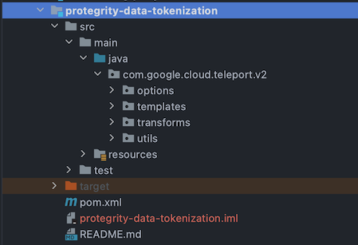

author: Ilya Kozyrev
summary: In this codelab you'll learn how to add new input source to the Dataflow template using Beam Schema API. And how to build Beam pipeline into Dataflow Template and run it in GCP
id: data-flow-templates-new-source-schema-api
categories: Dataflow,Beam,GCP,Dataflow Template
environments: Web
status: Draft
feedback link:https://github.com/ilya-kozyrev/codelabs


# Add new input source to the Dataflow Template using Beam Schema API
<!-- ------------------------ -->
## Introduction
Duration: 0:05:00

#### Goals

In this codelab you'll add new input source to existing pipeline, build pipeline to the Dataflow template and run it on GCP.
Through this codelab, you'll understand how to work with Beam Schema API and how this API help you to support multiple formats in your pipeline.

#### What you'll build

* New transformation for .parquet format into the Beam Row abstraction
* New transformation from Beam Row into .parquet format
* Read and Write methods for Beam using those transformations

#### What you'll learn
* How to use Beam Schema Api
* How to work with ParquetIO
* How to build pipeline into Dataflow Template
* How to run Dataflow Template in GCP

#### What you'll need
* A computer with a modern web browser installed (Chrome is recommended)
* Your favourite code editor or IDE
* A Google account

Next step: Environment Setup

<!-- ------------------------ -->
## Environment setup
Duration: 0:05:00

#### Install Java Environment

In order to work with Beam Java SDK you need *Java 1.8*, *mvn* (the java command line tool for build) installed.

1) Download and install the [Java Development Kit (JDK)](https://www.oracle.com/technetwork/java/javase/downloads/index.html) version 8. Verify that the [JAVA_HOME](https://docs.oracle.com/javase/8/docs/technotes/guides/troubleshoot/envvars001.html) environment variable is set and points to your JDK installation.

2) Download and install [Apache Maven](https://maven.apache.org/download.cgi) by following Maven’s [installation guide](https://maven.apache.org/install.html) for your specific operating system.


#### Install Git
The instructions below are what worked for Mac, but you can also find instructions [here](https://git-scm.com/download/)

```bash
$ brew install git
```

#### Clone the template repository
```bash
$ git clone https://github.com/akvelon/DataflowTemplates.git
```

#### Switch to the working branch
```bash
$ git checkout ProtegrityIntegrationTemplate
```

<!-- ------------------------ -->
## Project overview
Duration: 0:05:00

In your cloned  repository folder you might see `src` and `v2` folders. src and v2 folders contain classic and Flex templates correspondingly.

In this codelab you will work with Flex templates. 

Go to the template folder DataflowTemplates/v2/protegrity-data-tokenization

In the target folder you might see the template packages. Let's go through each of them.


* `options` package contains all pipeline parameters and logic around them
* `templates` package contains main class of presented template. There is pipeline creation and applying all transformations
* `transforms` package contains all Beam transform that applies to the pipeline
    * `io` subpackage contains transforms for input/output, e.g. to convert from format to Row and vise versa.
  
* `utils` package contains utils that used in pipeline for supporting operations, such us schema parsing or csv building
* `resources` folder contains metadata file, that will be need when you will build pipeline to the template.

As a next step you will go throughout the main class.
<!-- ------------------------ -->
## Main template class
Duration: 0:15:00

Let's go to the main template class `ProtegrityDataTokenization` and describe it. This class locates in `v2/protegrity-data-tokenization/src/main/java/com/google/cloud/teleport/v2/templates/ProtegrityDataTokenization.java`

As you now most java programs have main class with `main` method as an entry point for the application. There is very similar structure.

In `ProtegrityDataTokenization` class you may see main method with option parsing and calling run method
```java 
  public static void main(String[] args) {
    ProtegrityDataTokenizationOptions options =
        PipelineOptionsFactory.fromArgs(args)
            .withValidation()
            .as(ProtegrityDataTokenizationOptions.class);
    FileSystems.setDefaultPipelineOptions(options);

    DataflowPipelineOptions dataflowOptions = PipelineOptionsFactory.fromArgs(args)
        .withoutStrictParsing()
        .withValidation()
        .as(DataflowPipelineOptions.class);

    run(options, dataflowOptions);
  }
```
And in `run` method presented pipeline implements basic beam pipeline implementation flow. 
1) Pipeline creation:
```java 
Pipeline pipeline = Pipeline.create(options);
```
2) Applying necessary transformations:
```java
pipeline.apply()
```
3) Pipeline running by calling `run` method.
```java
pipeline.run();
```

Let's take a look at two interesting things in this class.

#### Schema
In the presented pipeline you may see schema reading, it's implementation to read schema in JSON BigQuery compatible format format to build Beam Rows
```java 
schema = new SchemasUtils(options.getDataSchemaGcsPath(), StandardCharsets.UTF_8);
```

#### Coder
As you know in Beam provides coder mechanism to serialisation/deserialization process. 
And for operate with some types you need specify coders by ```CoderRegistry``` or by 
applying ```.setCoder()``` to the PCollection. And for this case used Beam Schema API to represent 
data as Rows in PCollection.
```java
CoderRegistry coderRegistry = pipeline.getCoderRegistry();
coderRegistry
    .registerCoderForType(RowCoder.of(schema.getBeamSchema()).getEncodedTypeDescriptor(), 
        RowCoder.of(schema.getBeamSchema()));
```

Next step: You will take a look at schema in BigQuery compatible format.
<!-- ------------------------ -->
## Schema from Json
Duration: 0:15:00

Beam schema requires a type mapping mechanism from the input format. 
The type matching mechanism depends on the input format. There is might be structured formats like 
BigQuery datasets with metadata of tables where you can automatically take schema. 
And structured formats like JSON and CSV where you need to specify the schema for converting into 
Beam Rows. 

And one of the best approaches for the second case is JSON in BigQuery Schema compatible format.

```json
{
  "fields": [
    {
      "name": "ssn",
      "type": "STRING",
      "mode": "REQUIRED"
    },
    {
      "name": "firstname",
      "type": "STRING",
      "mode": "REQUIRED"
    },
    {
      "name": "lastname",
      "type": "STRING",
      "mode": "NULLABLE"
    }
  ]
}
```
You need to create json with `fields` collection that includes all input fields as json objects.

You need to create JSON with a `fields` collection that includes all input fields as JSON objects.

Each object should contains three attributes
* `name` Name of the field
* `type` Type of the field, in BigQuery [types](https://cloud.google.com/bigquery/docs/reference/standard-sql/data-types?hl=pl). Likely it's very closely with Beam schema Type. All Beam types supports with BigQuery
* `mode` Might be `REQUIRED` or `NULLABLE`

#### Schema parsing

To parse schema you need to implement parsing from JSON string using `BigQueryHelpers.fromJsonString()`

```java
void parseJson(String jsonSchema) throws UnsupportedOperationException {
    TableSchema schema = BigQueryHelpers.fromJsonString(jsonSchema, TableSchema.class);
    validateSchemaTypes(schema);
    bigQuerySchema = schema;
    jsonBeamSchema = BigQueryHelpers.toJsonString(schema.getFields());
}
```

And convert ```TableSchema``` to Beam `Schema` using `org.apache.beam.sdk.io.gcp.bigquery.BigQueryUtils.fromTableSchema`

You may see how it implements in presented pipeline `v2/protegrity-data-tokenization/src/main/java/com/google/cloud/teleport/v2/utils/SchemasUtils.java` class

Nex step: IO transform overview
<!-- ------------------------ -->
## GcsIO overview
Duration: 0:10:00

To transform many input formats to the Beam Row and from Beam Row into destination format, presented
pipeline implements IO transforms. Let's focus on GcsIO that works with Google Cloud Storage.

In the `v2/protegrity-data-tokenization/src/main/java/com/google/cloud/teleport/v2/transforms/io/GcsIO.java` you may see `FORMAT` enum, that covers all supported formats.
```java
public enum FORMAT {
    JSON,
    CSV,
    AVRO
}
```

For IO functionality `GcsIO` class provides two methods `read` 
```java
public PCollection<Row> read(Pipeline pipeline, SchemasUtils schema) {
    switch (options.getInputGcsFileFormat()) {
      case CSV:
        ...
      case JSON:
        return readJson(pipeline)
            .apply(new JsonToBeamRow(options.getNonTokenizedDeadLetterGcsPath(), schema));
      case AVRO:
        return readAvro(pipeline, schema.getBeamSchema());
      default:
        throw new IllegalStateException(
            "No valid format for input data is provided. Please, choose JSON or CSV.");

    }
  }
```

and `write`
```java
public POutput write(PCollection<Row> input, Schema schema) {
    switch (options.getOutputGcsFileFormat()) {
      case JSON:
        return writeJson(input);
      case AVRO:
        return writeAvro(input, schema);
      case CSV:
        return writeCsv(input, schema.getFieldNames());
      default:
        throw new IllegalStateException(
            "No valid format for output data is provided. Please, choose JSON or CSV.");

    }
}
```

For each supported format GcsIO encapsulates transformations from source format to Beam Row and 
from Beam Row to destination format for writing results. e.g. `writeAvro` or `writeAvro`. 
That takes pipeline and Schema as argument.

Next step: You will implement parquet files reading and writing and transformation this into the Beam Row.
<!-- ------------------------ -->
## Parquet IO Read
Duration: 0:15:00

To implement new parquet source read and write, firstly you need to add new value into `FORMAT` enum 

```java
public enum FORMAT {
    JSON,
    CSV,
    AVRO,
    PARQUET
  }
```

Next, you need to create a method to read parquet from the filesystem and convert it into Beam Row.

To read parquet you might use ParquetIO from Beam SDK. You need to apply `ParquetIO.read()` to the pipeline object.
```java
PCollection<GenericRecord> parquetRecords =
        pipeline.apply(ParquetIO.read(avroSchema).from(options.getInputGcsFilePattern()));
```

`ParquetIO.read()` takes Avro schema as a argument. And you need to convert Beam Schema to the Avro
schema using `AvroUtils.toAvroSchema()`
```
org.apache.avro.Schema avroSchema = AvroUtils.toAvroSchema(beamSchema);
```

Applying `ParquetIO.read()` to the pipeline produce `PCollection` of `GenericRecord` and you should 
convert it into the Beam Row. Easiest way to do that is applying `MapElements.into` to the 
`PCollection<GenericRecord>`. One thing that you need to provide to `via` method - transform 
function from `GenericRecord` into `Row`. And luckily it also contains in `AvroUtils`.

```java
parquetRecords
    .apply("GenericRecordsToRow", MapElements.into(TypeDescriptor.of(Row.class))
        .via(AvroUtils.getGenericRecordToRowFunction(beamSchema)))
```

The last thing that you need to do - specify the coder for the new PCollection. 
A fully implemented method: 


```
private PCollection<Row> readParquet(Pipeline pipeline, Schema beamSchema) {
    org.apache.avro.Schema avroSchema = AvroUtils.toAvroSchema(beamSchema);

    PCollection<GenericRecord> parquetRecords =
        pipeline.apply(ParquetIO.read(avroSchema).from(options.getInputGcsFilePattern()));

    return parquetRecords
        .apply("GenericRecordsToRow", MapElements.into(TypeDescriptor.of(Row.class))
            .via(AvroUtils.getGenericRecordToRowFunction(beamSchema)))
        .setCoder(RowCoder.of(beamSchema));
 }
```

Next step: you need to implement write method for writing Beam Row to the parquet format.
<!-- ------------------------ -->

## Parquet IO Write
Duration: 0:15:00

Let's implement write method for parquet format.

You need to create a method to transform Beam Row to parquet and write files to filesystem.

To write parquet you might use `FileIO` with `ParquetIO.sink()` from Beam SDK. 
You need to apply `FileIO.<GenericRecord>write()` to the `PCollection<GenericRecord>`.

Firstly you need to convert `PCollection<Row>` into `PCollection<GenericRecord>`. 
It's very similar with your implementation of conversion from GenericRecord to Row. For backward
conversion you might use `MapElements` with `AvroUtils.getRowToGenericRecordFunction()`
```java
PCollection<GenericRecord> genericRecords = outputCollection
     .apply(
        "RowToGenericRecord", MapElements.into(TypeDescriptor.of(GenericRecord.class))
            .via(AvroUtils.getRowToGenericRecordFunction(avroSchema)))
```

As you may see, `getRowToGenericRecordFunction` takes Avro Schema. You should convert Beam Schema to
the Avro schema using `AvroUtils`

```
org.apache.avro.Schema avroSchema = AvroUtils.toAvroSchema(beamSchema);
```

So, now, you have prepared `PCollection<GenericRecord>` and you may apply `FileIO.write()` to it.
It requires Generic type specifying.

```java
genericRecords.apply(FileIO.<GenericRecord>write()
    .via(ParquetIO.sink(avroSchema))
    .to(options.getOutputGcsDirectory()).withSuffix(".parquet")
```
As the argument to `ParquetIO.sink()` you should pass `avroSchema`, that you converted before from 
Beam Schema. Destination path, you may take from the pipeline options.

Next step: You should check your tokenization service

<!-- ------------------------ -->
## Tokenization service
Duration: 0:05:00

Presented templates provides data tokenization using external REST service 
and configured to communicate with tokenization service in following request format: 
```json
{
  ...
  "data":[
    {"<key>":"<value>", ...},
    {"<key>":"<value>", ...},
    {"<key>":"<value>", ...},
    ...
  ]
  ...
}
```
If your tokenization service have similar requirements for request structure, just skip this codelab 
section.

#### If you don't have tokenization service
To skip the tokenization step for testing purposes you need to replace the tokenization call in 
`ProtegrityDataProtectors`

1. Go to `v2/protegrity-data-tokenization/src/main/java/com/google/cloud/teleport/v2/transforms/ProtegrityDataProtectors.java`
2. Find processBufferedRows method
3. Replace
```java
private void processBufferedRows(Iterable<Row> rows, WindowedContext context) {

    try {
      for (Row outputRow : getTokenizedRow(rows)) {
        context.output(outputRow);
      }
    } catch (Exception e) {
      for (Row outputRow : rows) {
        context.output(
            failureTag,
            FailsafeElement.of(outputRow, outputRow)
                .setErrorMessage(e.getMessage())
                .setStacktrace(Throwables.getStackTraceAsString(e)));
      }

    }
}
```
with
```java
private void processBufferedRows(Iterable<Row> rows, WindowedContext context) {
  for (Row outputRow : rows) {
    context.output(row);
  }
    
}
```
Next step: You will take a look on metadata file and extend it for parquet format.

<!-- ------------------------ -->
## Template metadata
Duration: 0:05:00

For the building Dataflow Template, you should create JSON file with Template metadata. 

#### Metadata parameters
| Parameter Key	 | Required | Description of the value |
| --- | ----------- | --- |
| name | Yes | The name of your template. |
| description | No | A short paragraph of text describing the templates. |
| parameters | No. Defaults to an empty array. | An array of additional parameters that will be used by the template. |

#### Template parameters description in metadata file
| Parameter Key	 | Required | Description of the value |
| --- | ----------- | --- |
| name | Yes | 	The name of the parameter used in your template. |
| label | Yes | A human readable label that will be used in the UI to label the parameter. |
| helpText | Yes | A short paragraph of text describing the parameter. |
| isOptional | No. Defaults to false. | *false* if the parameter is required and *true* if the parameter is optional. |
| regexes | No. Defaults to an empty array. | An array of POSIX-egrep regular expressions in string form that will be used to validate the value of the parameter. For example: `["^[a-zA-Z][a-zA-Z0-9]+"]` is a single regular expression that validates that the value starts with a letter and then has one or more characters. |

#### Example metadata file
```json
{
  "description": "An example pipeline that counts words in the input file.",
  "name": "Word Count",
  "parameters": [
    {
      "regexes": [
        "^gs:\\/\\/[^\\n\\r]+$"
      ],
      "name": "inputFile",
      "helpText": "Path of the file pattern glob to read from. ex: gs://dataflow-samples/shakespeare/kinglear.txt",
      "label": "Input Cloud Storage file(s)"
    },
    {
      "regexes": [
        "^gs:\\/\\/[^\\n\\r]+$"
      ],
      "name": "output",
      "helpText": "Path and filename prefix for writing output files. ex: gs://MyBucket/counts",
      "label": "Output Cloud Storage file(s)"
    }
  ]
}
```

#### Add PARQUET to supported formats in Metadata file

In the metadata file, located: `v2/protegrity-data-tokenization/src/main/resources/protegrity_data_tokenization_metadata.json` 
you may see following parameters:
* inputGcsFileFormat
* outputGcsFileFormat

For these parameters you should add addition option in regex section to validate PARQUET format correctly

```json
"regexes": [
        "^(JSON|CSV|AVRO|PARQUET)$"
]
```

Next step: you will build pipeline into the template.

<!-- ------------------------ -->
## Build the Template
Duration: 0:05:00

Dataflow Flex Templates package the pipeline as a Docker image and stage these images on your
project's [Container Registry](https://cloud.google.com/container-registry).

#### Assembling the Uber-JAR

The Dataflow Flex Templates require your Java project to be built into an Uber JAR file.

Navigate to the v2 folder:

```
cd /path/to/DataflowTemplates/v2
```

Build the Uber JAR:

```
mvn package -am -pl protegrity-data-tokenization
```

ℹ️ An **Uber JAR** - also known as **fat JAR** - is a single JAR file that contains both target
package *and* all its dependencies.

The result of the `package` task execution is a `protegrity-data-tokenization-1.0-SNAPSHOT.jar`
file that is generated under the `target` folder protegrity-data-tokenization directory.

#### Creating the Dataflow Flex Template

Navigate to the template folder:

```
cd /path/to/DataflowTemplates/v2/protegrity-data-tokenization
```

Build command to build the Dataflow Flex Template:

```
gcloud dataflow flex-template build ${TEMPLATE_PATH} \
       --image-gcr-path "${TARGET_GCR_IMAGE}" \
       --sdk-language "JAVA" \
       --flex-template-base-image ${BASE_CONTAINER_IMAGE} \
       --metadata-file "src/main/resources/protegrity_data_tokenization_metadata.json" \
       --jar "target/protegrity-data-tokenization-1.0-SNAPSHOT.jar" \
       --env FLEX_TEMPLATE_JAVA_MAIN_CLASS="com.google.cloud.teleport.v2.templates.ProtegrityDataTokenization"
```
* `TEMPLATE_PATH` path on GCS where manifest for template will be located.
* `image-gcr-path` path in GCR, should be in format  `gcr.io/${PROJECT}/${IMAGE_NAME}`
* `sdk-language` might be Java or Python
* `flex-template-base-image` You must use a Google-provided [base image](https://docs.docker.com/glossary/#base_image) to package your containers using Docker. Choose the most recent version name from the [Flex Templates base images reference](https://cloud.google.com/dataflow/docs/reference/flex-templates-base-images). Do not select *latest*.
* `metadata-file` path to metadata file in this case: ``v2/protegrity-data-tokenization/src/main/resources/protegrity_data_tokenization_metadata.json``
* `jar` path to **UBER JAR** 
* `FLEX_TEMPLATE_JAVA_MAIN_CLASS` path to the main class. In this case: `com.google.cloud.teleport.v2.templates.ProtegrityDataTokenization`

Next step: You will run Dataflow Template on GCS!
<!-- ------------------------ -->
## Run the Template
Duration: 0:10:00

To deploy the pipeline, refer to the template file and pass the
[parameters](https://cloud.google.com/dataflow/docs/guides/specifying-exec-params#setting-other-cloud-dataflow-pipeline-options)
required by the pipeline.

The template requires banch of the parameters, in case of testing parquet format as an input source
you need to specify few of them.

- **dataSchemaGcsPath**: Path to data schema file located on GCS. BigQuery compatible JSON format data schema required 
- **inputGcsFilePattern**: GCS file pattern for files in the source bucket
- **inputGcsFileFormat**: File format of the input files. Supported formats: JSON, CSV, Avro and **PARQUET**
- **dsgUri**: URI for the DSG API calls, if you don't have this one. Just skip it.
- **outputGcsDirectory**: GCS bucket folder to write data to
- **outputGcsFileFormat**: File format of output files. Supported formats: JSON, CSV, Avro and **PARQUET**


<details>
  <summary>Full list of the parameters</summary>
  
- Data schema
    - **dataSchemaGcsPath**: Path to data schema file located on GCS. BigQuery compatible JSON format data schema required
- An input source from the supported options:
    - Google Cloud Storage
        - **inputGcsFilePattern**: GCS file pattern for files in the source bucket
        - **inputGcsFileFormat**: File format of the input files. Supported formats: JSON, CSV, Avro and **PARQUET**
        - CSV format parameters:
            - **csvContainsHeaders**: `true` if CSV file(s) in the input bucket contain headers, and `false` otherwise
            - **csvDelimiter**: Delimiting character in CSV. Default: delimiter provided in csvFormat
            - **csvFormat**: CSV format according to Apache Commons CSV format. Default is:
              [Apache Commons CSV default](https://static.javadoc.io/org.apache.commons/commons-csv/1.7/org/apache/commons/csv/CSVFormat.html#DEFAULT)
              . Must match format names exactly found
              at: https://static.javadoc.io/org.apache.commons/commons-csv/1.7/org/apache/commons/csv/CSVFormat.Predefined.html
    - Google Pub/Sub (Avro not supported)
        - **pubsubTopic**: Cloud Pub/Sub input topic to read data from, in the format of '
          projects/yourproject/topics/yourtopic'
- An output sink from the supported options:
    - Google Cloud Storage
        - **outputGcsDirectory**: GCS bucket folder to write data to
        - **outputGcsFileFormat**: File format of output files. Supported formats: JSON, CSV, Avro
        - **windowDuration**: The window duration in which data will be written. Should be specified
          only for 'Pub/Sub -> GCS' case. Defaults to 30s.

          Supported format:
            - Ns (for seconds, example: 5s),
            - Nm (for minutes, example: 12m),
            - Nh (for hours, example: 2h).
        - Google Cloud BigQuery
            - **bigQueryTableName**: Cloud BigQuery table name to write into
    - Cloud Bigtable
        - **bigTableProjectId**: Project ID containing Cloud Bigtable instance to write into
        - **bigTableInstanceId**: Cloud BigTable Instance ID of the Bigtable instance to write into
        - **bigTableTableId**: ID of the Cloud Bigtable table to write into
        - **bigTableKeyColumnName**: Column name to use as a key in Cloud Bigtable
        - **bigTableColumnFamilyName**: Column family name to use in Cloud Bigtable
- DSG parameters
    - **dsgUri**: URI for the DSG API calls
    - **batchSize**: Size of the data batch to send to DSG per request
    - **payloadConfigGcsPath**: GCS path to the payload configuration file with an array of fields
      to extract for tokenization

The template allows user to supply the following optional parameter:

- **nonTokenizedDeadLetterGcsPath**: GCS folder where failed to tokenize data will be stored
</details>


A Dataflow job can be created and executed from this template in 3 ways:

1. Using [Dataflow Google Cloud Console](https://console.cloud.google.com/dataflow/jobs)

// TODO add screenshots from console 

2. Using `gcloud` CLI tool
    ```bash
    gcloud dataflow flex-template run "protegrity-data-tokenization-`date +%Y%m%d-%H%M%S`" \
        --template-file-gcs-location "${TEMPLATE_PATH}" \
        --parameters <parameter>="<value>" \
        --parameters <parameter>="<value>" \
        ...
        --parameters <parameter>="<value>" \
        --region "${REGION}"
    ```
3. With a REST API request
    ```
    API_ROOT_URL="https://dataflow.googleapis.com"
    TEMPLATES_LAUNCH_API="${API_ROOT_URL}/v1b3/projects/${PROJECT}/locations/${REGION}/flexTemplates:launch"
    JOB_NAME="protegrity-data-tokenization-`date +%Y%m%d-%H%M%S-%N`"
    
    time curl -X POST -H "Content-Type: application/json" \
        -H "Authorization: Bearer $(gcloud auth print-access-token)" \
        -d '
         {
             "launch_parameter": {
                 "jobName": "'$JOB_NAME'",
                 "containerSpecGcsPath": "'$TEMPLATE_PATH'",
                 "parameters": {
                     "<parameter>": "<value>",
                     "<parameter>": "<value>",
                     ...
                     "<parameter>": "<value>"
                 }
             }
         }
        '
        "${TEMPLATES_LAUNCH_API}"
    ```

<!-- ------------------------ -->
## Contribute to DataflowTemplates
Duration: 0:05:00

pass
<!-- ------------------------ -->
## Finish
Duration: 0:05:00

pass